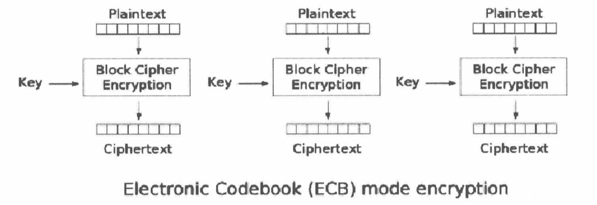
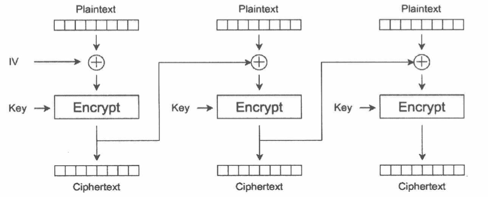

记录的比较简单，只为能有一个记录，如果想起来，能找到在哪里。

1. [白帽子讲Web安全 读书笔记一](/baimaozijiangwebanquan-dushubiji)
2. [白帽子讲Web安全 读书笔记二](/baimaozijiangwebanquan-dushubiji2)

!TOC

#更新日志
---

##第10章 访问控制     

1. 访问控制就是**授权**要解决的问题。

2. 权限控制，抽象的说，**都是某个主体（subject）对某个客体（object）需要实施某种操作（operation），而系统对这种操作的限制就是权限控制**。

3. 垂直权限管理---基于角色的访问控制（Role-Base Access Control），就是用户-角色-权限。

4. 水平权限管理---如同样的用户，一个可以可以查看另一个的文件，这就越权了，目前还仍然是一个难题。
 
5. OAuth，这个就像目前你用qq登陆其他网站，其他网站可以向你申请取得你的好友都有谁的权限，就是这么个功能。下面是新浪微博的OAuth授权图。
   

##第11章 加密算法与随机数

1. 常见的加密算法分为**分组加密算法**和**流密码加密算法**。分组加密算法基于“分组”（block），不同的算法分组长度也可能不同。分组加密的代表算法有DES、3-DES、Blowfish、IDEA、AES等。流密码加密算法，每次只处理一个字节，秘钥独立于消息之外，代表算法有RC4、ORYX、SEAL等。

2. 针对加密算法的攻击，一般根据攻击者能获得的信息，可以分为：

   * 唯密文攻击，攻击者有一些密文，他们是使用同一加密算法和同一秘钥加密的，这种攻击最难。
   * 已知明文攻击，攻击者除了能得到一些密文外，还能得到这些密文对应的明文。
   * 选择明文攻击，攻击者不仅能得到一些密文和明文，还能选择指定的明文加密为密文。
   * 选择密文攻击，攻击者可以选择不同的密文来解密。
 
3. Stream Cipher Attack

   1. Reused Key Attack
   
      在流密码体系中，最常见的**错误**就是使用同一个秘钥进行了多次加/解密，这将使破解流密码变得非常简单，这种攻击就叫做Reused Key Attack，在这种攻击下，用户不需要知道秘钥，即可还原出明文。简单的讲就是因为使用了同一个秘钥
      
      ```
      E(A) = A xor C
      E(B) = B xor C
      E(A) xor E(B) = A xor C xor B xor C = A xor B
      ```
      由上式可见只需要知道明文A，B，密文E(A),E(B)4个变量中，只要知道3个，就可以推算出另一个。
      
   2. Bit-flipping Attack
   
      在密码学中，攻击者在不知道明文的情况下，通过改变密文，使得明文按其需要的方式发生改变的攻击方式叫做Bit-flipping Attack。
      
   3. 弱随机IV（Initalization Vector）
   
      IV如果不够随机，能够被攻击者穷举，或者根据规律猜出，那么会导致密文被破解。WEP的破解，就是因为IV使用的24bit的值，但是由于数据传输的包很多，在几个小时以内，IV就会开始重复，只要找到使用相同IV加密的数据包，构造出相同的CRC-32校验，就可以破解出密码。
      
   4. ECB模式的缺陷
   
      ECB模式（电码簿模式）是一种最简单的加密模式，它的每个分组之间相对独立，加密过程如下
      
      
      但ECB模式罪的的问题也是处在这种分组的独立上，攻击者只需要对调任意分组的密文，在经过解密后，所得到的明文顺序也是经过对调的。对于ECB模式来说，改变分组密文的顺序，将改变解密后的明文顺序，替换某个分组密文，解密后对应分组的明文也会被替换，而其他分组不受影响。当加密的明文多余一个分组时，应该避免使用ECB模式。
      
   5. Padding Oracle Attack
   
      Eurocrypt 2002大会上，Vaudenay介绍了针对CBC模式的“Padding Oracle Attack”攻击，它可以在不知道秘钥的情况下，通过对padding bytes的尝试，还原明文，或者构造出任意明文的密文。
      
      下面是CBC模式的结构图
      
      
      在分组加密是，如果最后一组没有达到额定的长度，则要进行填充，称作padding。 这个需要另开一篇[博文]("padding")。
      
    6. 秘钥管理
    
       最最错误的就是`将秘钥硬编码在代码中`，写在代码中可以通过逆向来找出秘钥。对于CS程序，最好是通过网络验证，用专门的秘钥服务器，如果必须硬编码到代码中，可以使用Diifie-Hellman交换秘钥体系，BS程序可以保存在配置文件或数据库中。
       
    7. 伪随机数问题
    
       伪随机数（pseudo random number）的最大问题--不够随机，伪随机数随机的地方在于`种子`，一旦种子确定，使用同一种伪随机算法计算出来的随机数顺序也是固定的。由这个原因，就会产生许多的安全问题，一旦服务器使用的随机数种子可以被猜解，如使用时间作为随机数种子，只要攻击者能够指导服务器时间，那么就可以制造出伪随机数。
       
       哪些随机数安全呢，要使用足够强壮的随机数安全算法，Java可以使用java.security.SecureRandom，Linux可以使用/dev/random或者/dev/urandom，PHP 5.3.0及其之后的版本，若是支持openSSL扩展，也可以直接使用函数openssl_random_pseudo_bytes来生成随机数。 
    
##第12章 Web框架安全
1. 试试安全方案，要达到好的效果，必须要完成的两个目标：

   * 安全方案正确、可靠。
   * 能够发现所有可能存在的安全问题，不出现遗漏。
   
##第13章 应用层拒绝服务攻击
1. DDOS简介

   DDOS又称为分布式拒绝服务，全称Distributed Denial of Servcie。DDOS是利用合理的请求造成资源过载，服务不可用。常见的DDOS攻击有SYN flood、UDP flood、ICMP flood等。SYN flood是最经典的一种，其发现与1996年，到至今仍然有着非常强的生命力。SYN flood主要是利用了TCP协议的设计中的缺陷，所以想要修复这种缺陷几乎不可能了。
   
   简单的记录一下TCP的3次握手：
   
   * 首先，客户端向服务器端发送一个SYN包，包含客户端使用的端口号和初始序列号x。
   * 然后，服务器端收到SYN包后，向客户端发送一个SYN号y，确认号x+1的确认报文.
   * 最后，客户端收到服务器端返回的SYN+ACK，向服务器返回一个确认号为y+1，SYN号y+1的ACK报文，连接建立。
   
   而SYN flood漏洞就出在第一次客户端伪造IP向服务器端发送SYN包后，服务器发送确认报文后，一直在等在客户端的确认报文，但是IP是伪造的，一直会等不到，就一直占有一定的资源。当有大量的SYN连接发送来时，服务器就会资源耗尽。
   
2. 应用层DDOS

   目前几乎所有的商业Anti-DDOS设备，只在对抗网络层DDOS时效果比较好，对待应用层攻击确缺乏有效的对抗手段。

   1. CC攻击
      CC（Challenge Collapasar）攻击的前身是一个交fatboy的攻击程序，CC攻击的原理非常简单，就是对一些消耗资源特别大的应用页面不断发起正常的请求，以达到消耗服务器资源的目的。
      
   2. 限制请求频率：针对应用层DDOS攻击，应该对每一个每一个客户端做一个请求频率的限制。
   
   3. 然而，由于限制请求频率，往往使用的是利用IP和cookie来判定用户，但是这种判定方式太容易绕过了，使用代理等手段可以快速的切换IP，所以，要解决应用层DDOS应该从以下几个方面下手：
      
      * 应用代码做好性能优化。
      * 网络架构做好优化。
      * 增加一些对抗手段，如IP限制，总是会起一些用。
      
3. 验证码

   验证码还有一个很牛逼的名字CAPTCHA（Completely Automated Public Turing Tes To Tell Computers and Humans Apart，全自动区分计算机和人类的图灵测试）。验证码也有一些值得注意的地方，一个是很多验证码是可以使用计算机图形学来进行识别的，还有一些验证码所在页面的逻辑存在一些问题，比如验证码值存在session里，而在验证码使用后又没有进行更新，导致验证码可以重复是使用。
   
4. 应用层DDOS的防御

   除了增加验证码这种暴力手段外，还有一些这样的手段
   
   * 让客户端去解析一段js，或者flash，类似的东西都可以，用来判断用户是否是浏览器，但是这个方法有时候不管用，因为有时候攻击者使用的时基于浏览器插件类的攻击方式，这个方法就不能检测出来了。
   * 调整一些Web容器的配置，如Apache中的Timeout、KeepAliveTimeout、MaxClients等。
   * 一些Web容器有现成的防御措施供我们使用，如Apache的mod_qos模块。
   * 一些专用系统，如Yahoo开发的一套Detecting system abuse，它可以将所有访问Yahoo的IP进行计算访问频率，然后采取拦截措施。
   
5. 资源耗尽攻击

   除了CC攻击之外，攻击者还可能利用一些Web Server的漏洞或设计缺陷，直接造成拒绝服务攻击，给出几个例子：
   
   * Slowloris攻击：2009年RSnake提出的一种攻击方法，原理是以极低的速度网服务器发送HTTP请求，而由于Web Server对并发连接数都有一定的限制，因为如果恶心的占用这些连接不放，那么Web Server所有的连接都被占用后，就无法接受新的请求了。要保持一个连接，RSnake构造了一个**畸形**的HTTP Header，这个Header中以1一个CLRF结束的，而正常的Header需要两个，所以Web Server认为HTTP Header部分还没有结束，就保持连接不释放，继续等待完整请求，此时客户端只要继续发任意HTTP Header保持连接就可以了。**此类拒绝服务攻击的本质，实际上是对有限资源的无限制滥用**。
   * HTTP POST DOS：2010年OWASP大会，Wong Onn Chee和Tom Brennan演示了一个类似Slowloris的攻击方式，原理是发送HTTP POST包时，制定一个非常大的Content-Length值，然后以很低的速率发包，占据连接数，导致DOS。
   * Server limit DOS：Cookie也能造成一种拒绝服务攻击，Web Server对HTTP Header都有长度限制，如Apache默认为8192字节，如果服务器接收到的包比这个长，就会返回一个4xx错误。如果攻击者通过XSS攻击，恶意的向客户端写入了一个超长的Cookie，那么客户端在清空Cookie之前，就无法访问当前域的页面了，而Web Server会认为这是一个超长的非正常请求，导致客户端的拒绝服务。
   * ReDOS：这是一个正则表达式没有写好，而被恶意输入利用，造成的DOS。和前面的不一样，ReDOS是由于代码实现上的缺陷造成的DOS，类似于`^(a+)+`这类正则表达式，会造成遍历路径太多，耗尽系统资源。
 
##第14章 PHP安全
1. 文件包含漏洞
   
   严格的说，文件按包含漏洞是**代码注入**的一种。常见的文件包含函数有：
   
      * PHP：include()，include_once()，require()，require_once()，fopen()，readfile()...
      * JSP：ava.io.File()，java.io.File()...
      * ASP： include file，include virtual...
      
   PHP使用这四个函数include()，include_once()，require()，require_once()时，该文件当做PHP文件执行，PHP内核**并不会在意该被包含的文件是什么类型**。
   
   想要成功利用文件包含漏洞，需要满足一下两个条件：
      
      * include()等函数通过动态变量的方式引入需要包含的文件。
      * 用户能够控制这个变量。
   
   以下列出几种文件包含：
      
      1. 本地文件包含
      
         当碰到这种代码
         
         ```
         <?php
         $file = $_GET['file'];
         if(file_exists('/home/wwwrun/'.$file.'.php')){
             include '/home/wwwrun/'.$file.'.php';
         }
         ?>
         ```
         
         这种代码时，很明显`file`变量没有经过任何的过滤处理，用户可以很轻松的控制`file`变量，这就造成了本地文件包含漏洞，当用户输入`../../etc/passwd`，PHP将访问/etc/passwd文件，但是此代码后连接了`.php`后缀，这样文件名就变成了`/home/wwwrun/../../etc/passwd.php`，这个文件时不存在的，肯定无法访问，但是PHP使用C语言实现内核，对`\0x00`是敏感的，可以有效的截断字符串，用户只要输入`../../etc/passwd%00`，就可以顺利访问文件了。
         
         可能有一种处理方式，是将`0x00`字符过滤掉，但是在有些时候这样是不能起到作用的，比如在windows路径最大长度为256字节，那么如果用户故意输入的路径鲳鱼256字节，系统就会自动截断后面的字符，只使用前面的字符。
         
         同时，在这个例子中，可以使用`../../../`这样的方式来返回上层目录，这种方式被叫做**目录遍历**。这就实现了跨目录访问，服务器可以通过配置basedir来防止这种攻击，如PHP中的open_basedir，可以防止跨目录访问，open_basedir的作用是限制某个特定目录下PHP才能打开文件，它和safe_mode开否开启无关。
         
         要解决文件包含漏洞，应该尽量避免使用动态包含变量，还有一种方式，使用枚举方式来解决控制文件。如
         
         ```
         <?php
         $file = $_GET['file'];
         switch($file){
             case 'main':
             case 'bar':
                 include 'asda.php';
                 break;
             default:
                 include "asdfasdf.php";
         }
         ?>
         ```
         
      2. 远程文件包含
      
         和本地文件包含类似，远程文件包含是指被控制的变量指向的时一个外部服务器的文件，当然这个文件很有可能是恶意代码，执行命令什么的就so easy。防御可以利用服务器配置来关闭加载远程文件，如PHP的allow_url_include。

      3. 本地文件包含的利用技巧
      
         本地文件想要执行命令，就必须能够找到一个能够被控制的本地文件。安全研究者总结了以下几种技巧，用于本地文件包含后执行PHP代码。
         * 包含用户上传的文件。
         * 包含data:// 或 php://input 等伪协议。
         * 包含Session文件。
         * 包含日志文件，如access log，error log 等。
         * 包含/proc/self/environ文件。
         * 包含上传的临时文件。
         * 包含其他应用创建的文件，比如数据库文件，缓存文件，应用日志文件等等。
         
2. 变量覆盖漏洞

   1. 全局变量覆盖
   
      变量如果未被初始化，且能被用户控制那么很可能会导致安全问题，而在PHP中，这种情况在register_globals为on时尤为严重。
   
      如代码
   
      ```
      <?php
      if($auth){
          echo "private";
      }
      ?>
      ```
   
      当register_globals为off是，输入链接`http://****.com/test.php?auth=1`，不会有什么问题，但是当register_globals为on时，变量`$auth`就会被复制，导致if语句内容被执行。
   
      类似的，通过`$GLOBALS`获取的变量，页可能导致变量覆盖，如代码
   
      ```
      <?php
      if(ini_get('register_globals')) foreach($_REQUEST as $k=>$v) unset(${$k});
      print $a;
      print $_GET[b];
      ?>
      ```
   
      当register_globals为on，尝试控制变量`$a`，会因为禁用register_globals的代码
   
      ```
      if(ini_get('register_globals')) foreach($_REQUEST as $k=>$v) unset(${$k});
      ```
   
      而出错，使用的url是`http://***.com/test.php?a=1&b=2`。
   
      而尝试注入`GLOBALS[a]`覆盖全局变量时，则可以成功控制变量`$a`，提交的url为`http://***.com/test.php?a=GLOBALS[a]=1&b=2`，因为unset()函数默认只能销毁局部变量，而销毁全局变量必须使用GLOBALS如unset(GLOBALS[a])。在registe_globals=off时，无法覆盖全局变量。
   
      所以如果实现代码关闭了register_globals，则一定要覆盖素有的superglobals。
 
   2. extract()变量覆盖 
   
      extract()函数能够将变量从数组导入当前的符号表。函数定义如下
      
      ```
      int extract(array $var_array [, int $extract_type [, string $prefix]])
      ```
      
      其中，第二参数指定函数将变量导入符号表的行为，最常见的两个知识EXTR_OVERWRITE和EXTR_SKIP，一个表示导入符号表时，如果变量名冲突，则覆盖已有变量，一个是跳过不覆盖。默认使用EXTR_OVERWRITE。
      
      了解了函数的功能，很容易就能想到如果extract()中的变量被用户能够控制，那么就能够实现变量覆盖了。
      
   3. 遍历初始化变量
   
      常见的一些以遍历的方式释放变量的代码，也可能导致变量覆盖。如代码
   
      ```
      <?php
      $chs = '';
      if($_POST && $charset != 'utf-8'){
          $chs = new Chindes('UTF-8',$charset);
          foreach($_POST as $key=>$value){
              $$key = $chs->Convert($value);
          }
          unset($chs);
      }
      ?>
      ```
   
      若提交参数chs，则可覆盖变量`$chs`的值。代码审计的时候要注意类似`$$k`的变量赋值方式，这很有可能导致变量覆盖。

   4. import_request_variables变量覆盖
   
      和extract()类似，这个函数将GET、POST、Cookie的变量导入全局，并且可以指定变量前缀，如果不指定，将会覆盖全局变量。
      
   5. parse_str()变量覆盖
   
      parse_str()函数往往被用于解析URL的query string，但是参数值能够被用户控制时，可能导致变量覆盖。和上面两个类似，默认参数会覆盖同名变量。和parse_str()类似的还有mb_parse_str()。
   
   为了对抗各种各样的变量覆盖，给出这样几点安全建议：
   
      * 首先，确保register_globals=OFF，若不能自定义php.ini，则应该在代码中控制。
      * 其次，熟悉可能造成变量覆盖的函数和方法，检查用户是否能够控制变量的来源。
      * 最后，养成初始化变量的好习惯。
      
3. 代码执行漏洞

   代码执行的情况也非常灵活，但是离不开两点，一个是用户能够控制的函数输入，一个是存在可以执行代码的危险函数。
   
   在PHP中，能执行代码的不止文件包含一种，还有如危险函数popen(),system(),passthru(),exec()等都可以直接执行系统命令。eval()也可以直接执行PHP代码。 
 
   **挖掘漏洞的过程，通常需要先找到危险函数，然后回溯函数的调用过程，最终看在整个调用的过程中用户是否能够有可能控制输入**。

   一些常见的代码执行漏洞：
   
   * 直接执行代码的函数，如eval()，assert()，system()，exec()，shell_exec()，passthru()，escapeshellcmd()，pcntl_exec()。一般来说，最好再PHP中禁用这些函数。在审计代码的时候，着重审查是否有这些函数存在，然后溯本根源，看参数是否能够被用户控制。
   * 文件包含，要高度注意的函数include()，include_once()，require()，require_once()。
   * 本地文件写入，常见的函数有file_put_contents()，fwrite()，fputs()等。
   * preg_replace()代码执行，preg_replace


##第15章 WebServer配置安全

#第四章 互联网公司安全运营
---
##第16章 互联网业务安全

##第17章 安全开发流程（SDL）

##第18章 安全运营      
      
#参考文献
---
1. 白帽子讲Web安全 吴翰清